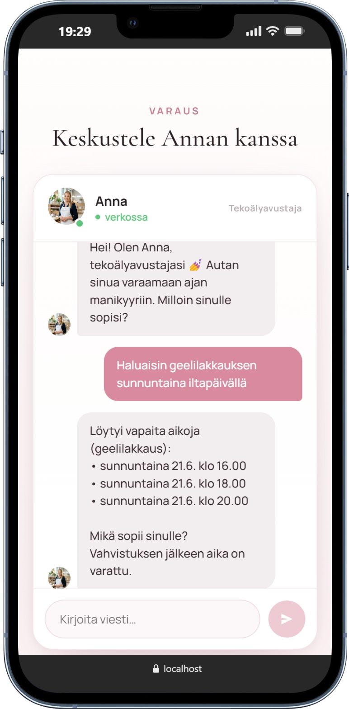

# BookMyNails 💅

AI-ассистент для бронирования времени у самозанятого мастера маникюра в Финляндии. Клиентка пишет на финском что угодно — «ensi tiistai iltapäivällä geelilakkaus» — Groq извлекает дату, время и услугу, находит свободный слот в PostgreSQL и атомарно фиксирует бронь.




## Как это работает

```
клиентка пишет → POST /api/ai/chat
               → Groq (JSON mode, Finnish system prompt)
               → Zod валидация extraction
               → поиск слота (ANY($dates::date[]), фильтр по времени и длительности)
               → suggestedSlots → фронтенд показывает карточки
               → клиентка нажимает Varaa → форма имя + телефон
               → POST /api/bookings/confirm
               → SELECT FOR UPDATE → INSERT booking → UPDATE slot → COMMIT
               → подтверждение в чате
               → (roadmap) Twilio SMS клиентке и мастеру
```

## Интересные технические решения

**EXCLUDE constraint против пересечения слотов**
```sql
ALTER TABLE availability_slots
  ADD CONSTRAINT no_overlap EXCLUDE USING gist (
    technician_id WITH =,
    tstzrange(start_at, end_at) WITH &&
  );
```
PostgreSQL не даст вставить два слота одного мастера с пересекающимися временными диапазонами на уровне БД — не на уровне приложения.

**SELECT FOR UPDATE против гонки бронирований**
```sql
SELECT id, technician_id FROM availability_slots
WHERE id = $1 AND is_booked = false
FOR UPDATE;
```
При двух одновременных запросах на один слот второй транзакция ждёт завершения первой. Если слот уже помечен как `is_booked = true` — второй получает 409 Conflict, не тихую ошибку.

**Failure-aware retry стратегия**
```
429 → мгновенный fallback на llama-3.1-8b-instant (ждать смысла нет — квота исчерпана)
503 → exponential backoff: 4 с → 8 с → 16 с (модель перегружена, подождём)
401/403 → fail-fast break (конфигурационная ошибка, ретраи не помогут)
```

**Парсинг финского естественного языка**

Groq извлекает `date` как свободный текст («huomenna», «ensi maanantai», «24.6.»). `availability.service.js` переводит это в ISO-даты с учётом часового пояса Хельсинки (UTC+3) — `Intl.DateTimeFormat('sv-SE', { timeZone: 'Europe/Helsinki' })` вместо `toISOString()`, которая даёт UTC и ошибается после 22:00.

## Стек

| Слой | Технологии |
|------|-----------|
| Frontend | React 19, Vite, React Router |
| Backend | Node.js, Express 5, ESM |
| AI | Groq API (`llama-3.3-70b-versatile`), groq-sdk, Zod v4 |
| База данных | PostgreSQL (Supabase), pgx GIST extension |
| Архитектура | routes → controllers → services → repositories |

## Запуск локально

```bash
# 1. Клонируем
git clone https://github.com/Rellance/bookmynails.git
cd bookmynails

# 2. Backend
cd server
npm install
cp .env.example .env
# Заполни DATABASE_URL и GROQ_API_KEY в .env

# Применяем миграцию (один раз)
psql $DATABASE_URL -f src/db/migrations/001_init.sql

node server.js           # http://localhost:3001

# 3. Frontend (отдельный терминал)
cd ../client
npm install
npm run dev              # http://localhost:5173
                         # Vite проксирует /api → :3001
```

Получить бесплатный Groq API ключ: [console.groq.com](https://console.groq.com).

## Roadmap

- [ ] Twilio SMS-напоминания клиентке за 24 ч и за 2 ч до записи
- [ ] TechnicianDashboard — мастер видит свои брони, управляет слотами и услугами
- [ ] Деплой на Azure App Service (backend) + Azure Static Web Apps (frontend)
- [ ] Azure Functions для cron-отправки SMS-напоминаний
- [ ] Дублирование на нескольких мастеров (multi-tenant по `technician_id`)
- [ ] Дата-range фильтр и экспорт брони в CSV

## Лицензия

MIT
